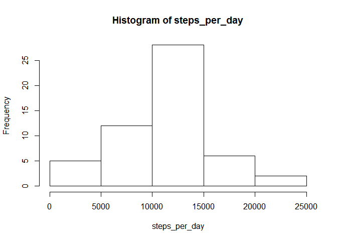
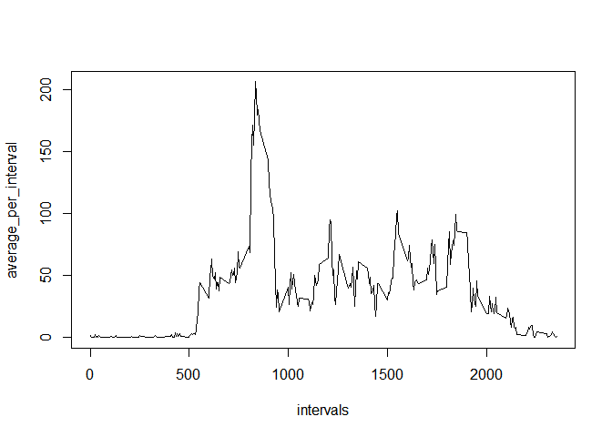
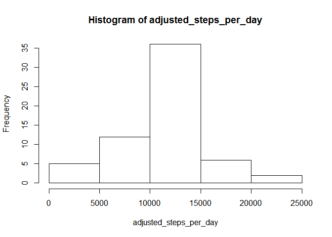
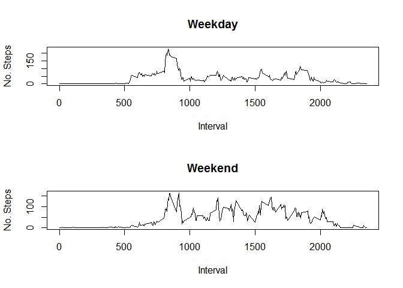

# Reproducible Research: Peer Assessment 1


## Loading and preprocessing the data
Load the data and convert the date column to POXIXlt

```r
data <- read.csv(unz("activity.zip", "activity.csv"))
```

## What is mean total number of steps taken per day?

Calculate steps per day and display frequency in a histogram

```r
steps_per_day <- tapply(data$steps, data$date, sum)
hist(steps_per_day)
```

<!-- -->

Now determine the mean and median:

```r
mean(steps_per_day, na.rm=TRUE)
```

```
## [1] 10766.19
```

```r
median(steps_per_day, na.rm=TRUE)
```

```
## [1] 10765
```


## What is the average daily activity pattern?

Calculate average per interval, plot, and determine 5 min interval with the average maximum:

```r
average_per_interval <- tapply(data$steps, data$interval, mean, na.rm=TRUE)
intervals <- unique(data$interval)
plot(intervals, average_per_interval, type="l")
```

<!-- -->

```r
maximum <- which.max(average_per_interval)
unique(data$interval)[maximum]
```

```
## [1] 835
```

## Imputing missing values
Determine the number of missing values:

```r
sum(is.na(data$steps))
```

```
## [1] 2304
```

Now replace the missing values with the mean for that of the 5 minute interval. 

```r
library(data.table)
data_filled_in <- copy(data)
names(average_per_interval) <- intervals
data_filled_in$steps[is.na(data_filled_in$steps)] <- average_per_interval[as.character(data_filled_in$interval[which(is.na(data_filled_in$steps))])]
```

Calculate steps per day and display frequency in a histogram

```r
adjusted_steps_per_day <- tapply(data_filled_in$steps, data$date, sum)
hist(adjusted_steps_per_day)
```

<!-- -->

Now determine the mean and median:

```r
mean(adjusted_steps_per_day)
```

```
## [1] 10766.19
```

```r
median(adjusted_steps_per_day)
```

```
## [1] 10766.19
```

The total number of steps has increased, and the median is now the same as the mean. There is little difference between the old mean and median and the new one.   

## Are there differences in activity patterns between weekdays and weekends?
Determine which days are weekends and which are weekdays

```r
data_filled_in$date <- strptime(data_filled_in$date, "%Y-%m-%d")
weektype <- as.factor(ifelse(weekdays(data_filled_in$date, abbreviate=TRUE) %in% c("Sat", "Sun"), "Weekend", "Weekday"))
data_filled_in$weektype <- weektype
```

Now determine the average for 5 minute interval for the weekday and wekend and plot.

```r
average_per_interval_week <- tapply(data_filled_in$steps, list(data_filled_in$weektype, data_filled_in$interval), mean, na.rm=TRUE)
average_per_interval_week <- t(average_per_interval_week)
average_per_interval_week <- as.data.frame(average_per_interval_week)
average_per_interval_week$interval <- row.names(average_per_interval_week)

par(mfrow=c(2,1))
plot(average_per_interval_week$interval, average_per_interval_week$Weekday, type="l", xlab="Interval", ylab="No. Steps", main="Weekday")
plot(average_per_interval_week$interval, average_per_interval_week$Weekend, type="l", xlab="Interval", ylab="No. Steps", main="Weekend")
```

<!-- -->
